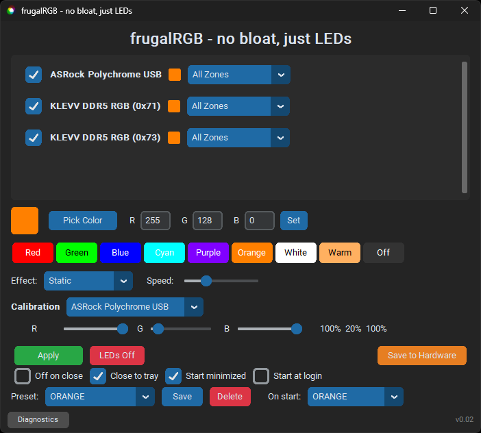

# frugalRGB — no bloat, just LEDs

A lightweight, standalone RGB controller for PC hardware. Built for personal use as a replacement for [SignalRGB](https://signalrgb.com/) (too bloated) and [OpenRGB](https://openrgb.org/) (conflicts with Stream Deck, buggy on some hardware).



## Supported devices

This app was built for **my specific hardware**. It currently supports:

| Device | Connection | Notes |
|--------|-----------|-------|
| **ASRock Polychrome USB** (VID `26CE`, PID `01A2`) | USB HID | Tested on ASRock Z890M Riptide. Does **not** require admin. |
| **MSI Mystic Light** (VID `1462`, 185-byte protocol) | USB HID | Tested on MSI MPG Z790I EDGE WIFI (PID `7E03`). Does **not** require admin. |
| **ENE AUDA-series DDR5 DRAM RGB** (addresses `0x70`–`0x77`) | SMBus (i801) | Tested with KLEVV DDR5 RGB. **Requires admin** (kernel-level SMBus access). |

### What about my hardware?

There is a **Diagnostics** button in the app that collects device info, register dumps, and system details into a zip file on your Desktop. If you'd like support for your hardware, you can [open an issue](../../issues) and attach that zip. I'll do my best to look into it, but there's no commitment to extend support — this is a personal project.

## Features

- **Static color** — pick any color via the color picker, preset buttons, or manual RGB entry
- **Effects** — breathing, color cycle, rainbow, strobe — all with adjustable speed
- **Per-device color** — untick a device to freeze its color, tick another and pick a different color; Apply sends each device its own color
- **Per-LED DRAM color** — set different colors on individual LEDs per RAM stick via zone dropdown (All LEDs, LED 1–8)
- **Per-device calibration** — RGB brightness correction sliders per device to compensate for LED imbalance
- **Presets** — save/load/overwrite/delete named presets (color + effect + speed)
- **Startup preset** — automatically apply a preset on launch
- **System tray** — minimize to tray, close to tray, load presets from tray menu
- **Start minimized** — launch hidden in the tray
- **Start at login** — when running as Administrator, creates a Windows scheduled task that launches the app at login with elevated privileges and no UAC prompt; when running without admin, creates a standard startup shortcut (note: Windows Defender may also flag the scheduled task creation — see [Windows Defender](#pre-built-exe-windows) note above)
- **`--apply-quit` mode** — apply the startup preset and exit immediately (saves RAM for always-on setups)
- **Save to Hardware** — write the current color/mode to the DRAM controller's non-volatile flash so it persists across power cycles (boot color). See [warning below](#save-to-hardware-warning)
- **Diagnostics** — collect system info, USB HID enumeration, SMBus scan, device register dumps, and config files into a zip for troubleshooting
- **Cross-platform** — runs on Windows (PawnIO driver) and Linux (smbus2); Linux support is untested
- **Single instance** — prevents duplicate instances with a friendly notification

## Installation

### Pre-built exe (Windows)

Download `frugalRGB.zip` from the [Releases](../../releases) page, extract it, and run `frugalRGB.exe`.

- For **motherboard RGB only** (ASRock Polychrome USB): no admin required.
- For **RAM RGB** (DDR5 via SMBus): run as Administrator.

> **Windows Defender:** Because this is an unsigned PyInstaller executable, Windows Defender may flag it as a threat. You'll need to allow it manually (Windows Security > Virus & threat protection > Protection history > Allow on device). This is a common false positive with PyInstaller-packaged apps.

### Prerequisites for RAM RGB (SMBus)

On Windows, DDR5 DRAM RGB control requires kernel-level port I/O access through [PawnIO](https://pawnio.eu/):

1. Install PawnIO from https://pawnio.eu/
2. Download `SmbusI801.bin` from [PawnIO.Modules releases](https://github.com/namazso/PawnIO.Modules/releases)
3. Place `SmbusI801.bin` in the `modules/` folder next to the app (or next to the exe's `_internal/modules/`)
4. Run as Administrator

### From source

```bash
git clone https://github.com/emaspa/frugalRGB.git
cd frugalRGB
pip install -r requirements.txt
```

Run:
```bash
# For motherboard RGB only (no admin needed):
pythonw main.pyw

# For RAM RGB (needs admin):
# Run your terminal as Administrator, then:
pythonw main.pyw
```

### Build the exe yourself

```bash
pip install pyinstaller
python build.py
```

Output: `dist/frugalRGB/frugalRGB.exe`

## Configuration

Config files are stored in your home directory:

- `~/.frugalrgb_config.json` — calibration, UI options, startup preset
- `~/.frugalrgb_presets.json` — saved presets

### `--apply-quit` flag

For a "set and forget" setup, create a shortcut to:
```
frugalRGB.exe --apply-quit
```
This applies the configured startup preset and exits immediately — no window, no tray, minimal resource usage.

### Save to Hardware warning

The **Save to Hardware** button writes the current color and mode to the ENE DRAM controller's non-volatile flash memory, so your RAM sticks display that color at every boot — before Windows even loads.

> **Use at your own risk.** This operation is known to be unstable on some ENE firmware versions. In rare cases it can soft-lock the RGB controller, making the LEDs unresponsive. Recovery typically requires physically reseating the DIMM. OpenRGB disables this feature by default for the same reason.
>
> The app requires a **double confirmation** before saving. Make sure you have already clicked **Apply** with the desired color/mode before saving.
>
> If you just want your color applied at every boot without touching hardware flash, use the **startup preset** + **Start at login** approach instead — that's the safer option.

## Architecture

```
main.pyw                      Entry point
frugalrgb/
  controllers/
    base.py                   Abstract controller interface
    detect.py                 Device auto-detection
    asrock_polychrome.py      ASRock Polychrome USB HID protocol
    msi_mystic_light.py       MSI Mystic Light USB HID protocol
    ene_dram_ddr5.py          ENE AUDA DDR5 DRAM SMBus protocol
  smbus/
    interface.py              Platform-agnostic SMBus ABC
    windows.py                PawnIO-backed i801 SMBus (Windows)
    linux.py                  /dev/i2c-* via smbus2 (Linux)
  effects/
    engine.py                 Threaded effect loop (hw or sw)
  gui/
    app.py                    CustomTkinter main window + tray
    widgets.py                Device cards, presets, calibration
  diagnostics.py              Diagnostics zip collector
build.py                      PyInstaller build script
modules/
  SmbusI801.bin               PawnIO kernel module (not included — download separately)
```

## License

This project is provided as-is for personal use. No warranty. Use at your own risk.
