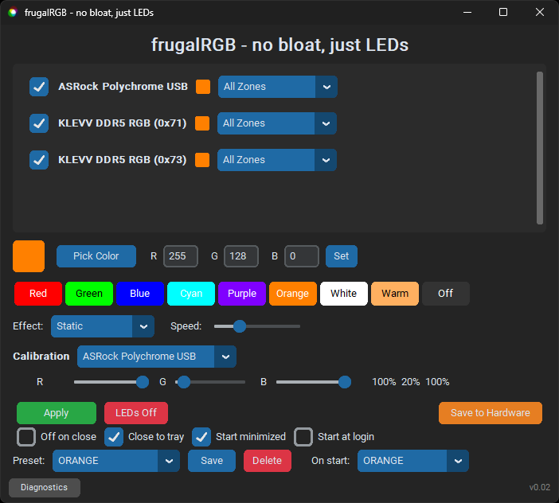

# frugalRGB — no bloat, just LEDs

A lightweight, standalone RGB controller for PC hardware. Built for personal use as a replacement for [SignalRGB](https://signalrgb.com/) (too bloated) and [OpenRGB](https://openrgb.org/) (conflicts with Stream Deck, buggy on some hardware).



## Supported devices

This app was built for **my specific hardware**. It currently supports:

| Device | Connection | Notes |
|--------|-----------|-------|
| **ASRock Polychrome USB** (VID `26CE`, PID `01A2`) | USB HID | Tested on ASRock Z890M Riptide. Does **not** require admin. |
| **MSI Mystic Light** (VID `1462`, 185-byte protocol) | USB HID | Tested on MSI MPG Z790I EDGE WIFI (PID `7E03`). Does **not** require admin. |
| **Gigabyte RGB Fusion 2.0** (VID `048D`, ITE IT5711/IT8297) | USB HID | Tested on Gigabyte X870E Aorus Master X3D. Does **not** require admin. |
| **ASUS Aura USB** (VID `0B05`) | USB HID | Mainboard protocol — onboard RGB + addressable headers, auto-detected from the device config table (PIDs `19AF`/`1939`/`18F3`). Does **not** require admin. |
| **ASUS GPU RGB** (ENE controller at I2C `0x67`) | NvAPI I2C (Windows) / i2c-dev (Linux) | Tested on ASUS TUF RTX 5090. Does **not** require admin (Linux: `i2c` group). NVIDIA GPU only. |
| **ENE AUDA-series DDR5 DRAM RGB** (addresses `0x70`–`0x77`) | SMBus (i801/PIIX4) | Tested with KLEVV DDR5 RGB. **Requires admin on Windows** (kernel-level SMBus access); on Linux the `i2c` group is enough. Supports Intel (i801) and AMD (PIIX4) chipsets. |

### What about my hardware?

There is a **Diagnostics** button in the app that collects device info, register dumps, and system details into a zip file on your Desktop. Run as admin to include SMBus/RAM data. If you'd like support for your hardware, you can [open an issue](../../issues) and attach that zip. I'll do my best to look into it, but there's no commitment to extend support — this is a personal project.

## Features

- **Static color** — pick any color via the color picker, preset buttons, or manual RGB entry
- **Effects** — breathing, color cycle, rainbow, strobe — all with adjustable speed
- **Per-zone color** — every RGB zone (Logo, Accent, D_LED1, LED 1–8, etc.) is its own card with independent color and on/off control
- **Per-device calibration** — RGB brightness correction sliders per device to compensate for LED imbalance
- **Presets** — save/load/overwrite/delete named presets; saves per-zone color, enabled state, effect, and speed
- **Startup preset** — automatically apply a preset on launch
- **System tray** — minimize to tray, close to tray, load presets from tray menu
- **Start minimized** — launch hidden in the tray
- **Start at login** — when running as Administrator, creates a Windows scheduled task that launches the app at login with elevated privileges and no UAC prompt; when running without admin, creates a standard startup shortcut (note: Windows Defender may also flag the scheduled task creation — see [Windows Defender](#pre-built-exe-windows) note above)
- **`--apply-quit` mode** — apply the startup preset and exit immediately (saves RAM for always-on setups)
- **Save to Hardware** — write the current color/mode to the DRAM controller's non-volatile flash so it persists across power cycles (boot color). See [warning below](#save-to-hardware-warning)
- **Diagnostics** — collect system info, USB HID enumeration, SMBus scan, device register dumps, and config files into a zip for troubleshooting (run as admin to include SMBus/RAM data)
- **Aura Test** — for ASUS Aura boards, shows the detected controller's firmware and zone layout and cycles the LEDs through red/green/blue/white to confirm lighting is working
- **Cross-platform** — runs on Windows (PawnIO driver) and Linux (hidapi + smbus2), see [Linux](#linux-from-source) for setup
- **Single instance** — prevents duplicate instances with a friendly notification

## Installation

### Pre-built exe (Windows)

Download `frugalRGB.zip` from the [Releases](../../releases) page, extract it, and run `frugalRGB.exe`.

- For **motherboard/USB RGB** (ASRock, MSI, Gigabyte, ASUS controllers): no admin required.
- For **RAM RGB** (DDR5 via SMBus): run as Administrator.

> **Windows Defender:** Because this is an unsigned PyInstaller executable, Windows Defender may flag it as a threat. You'll need to allow it manually (Windows Security > Virus & threat protection > Protection history > Allow on device). This is a common false positive with PyInstaller-packaged apps.

### Prerequisites for RAM RGB (SMBus)

On Windows, DDR5 DRAM RGB control requires kernel-level port I/O access through [PawnIO](https://pawnio.eu/):

1. Install PawnIO from https://pawnio.eu/
2. Download `SmbusI801.bin` from [PawnIO.Modules releases](https://github.com/namazso/PawnIO.Modules/releases)
3. Place `SmbusI801.bin` in the `modules/` folder next to the app (or next to the exe's `_internal/modules/`)
4. Run as Administrator

### From source

```bash
git clone https://github.com/emaspa/frugalRGB.git
cd frugalRGB
pip install -r requirements.txt
```

Run:
```bash
# For motherboard RGB only (no admin needed):
pythonw main.pyw

# For RAM RGB (needs admin):
# Run your terminal as Administrator, then:
pythonw main.pyw
```

### Arch Linux (AUR)

```bash
yay -S frugalrgb
```

Installs the app, the udev rules, a desktop entry, and the kernel module autoload config. After installing: add your user to the `i2c` group for DRAM RGB, and on boards whose BIOS claims the SMBus (most Gigabyte boards) boot with `acpi_enforce_resources=lax` (details in the Linux section below). The PKGBUILD lives in [`aur/`](aur/).

### Linux (from source)

Tested on Arch (CachyOS) with the Gigabyte X870E Aorus Master X3D and the KLEVV DDR5 kit above.

Install dependencies. The GUI needs Tk, and most distros block `pip install` into the system Python, so use a venv:

```bash
sudo pacman -S tk    # Debian/Ubuntu: sudo apt install python3-tk python3-venv

git clone https://github.com/emaspa/frugalRGB.git
cd frugalRGB
python -m venv .venv
.venv/bin/pip install -r requirements.txt
```

**USB RGB** (motherboard controllers): no root needed. Install the udev rules so the app can open the devices as a normal user, then replug or retrigger:

```bash
sudo cp 70-frugalrgb.rules /etc/udev/rules.d/
sudo udevadm control --reload && sudo udevadm trigger
```

**RAM RGB** (DDR5 via SMBus): also no root needed on Linux. Join the `i2c` group and load the chipset SMBus driver:

```bash
sudo usermod -aG i2c $USER    # then log out and back in
# AMD chipsets (Intel: i2c-i801 instead)
echo i2c-piix4 | sudo tee /etc/modules-load.d/i2c-piix4.conf
sudo modprobe i2c-piix4
```

On many boards (Gigabyte in particular) the BIOS claims the SMBus region for itself and the kernel then refuses to bind the driver: `dmesg` shows `ACPI Warning: SystemIO range ... conflicts with OpRegion`. Boot with the kernel parameter `acpi_enforce_resources=lax` to allow it. This is the same access pattern RGB tools rely on under Windows, where no such check exists; OpenRGB documents the same parameter for DRAM RGB.

**System tray icon**: for a proper transparent tray icon, pystray needs its appindicator backend (the native StatusNotifier protocol on KDE and GNOME). Install PyGObject and the Ayatana appindicator library, and let the venv see system packages:

```bash
sudo pacman -S python-gobject libayatana-appindicator    # Debian/Ubuntu: python3-gi gir1.2-ayatanaappindicator3-0.1
python -m venv --system-site-packages .venv    # or set include-system-site-packages = true in .venv/pyvenv.cfg
```

Without these, pystray falls back to its legacy X11 backend. The app still works and flattens the tray icon onto a dark tile (KDE's xembed proxy would otherwise render transparency as a green square), but the icon loses transparency.

Run with:

```bash
.venv/bin/python main.pyw
```

Note: the PyPI `hidapi` wheel uses its libusb backend, which detaches the `usbhid` kernel driver from the RGB controller's interface while the app has it open. That is harmless for a dedicated RGB device.

### Build the exe yourself

```bash
pip install pyinstaller
python build.py
```

Output: `dist/frugalRGB/frugalRGB.exe`

## Configuration

Config files are stored in your home directory:

- `~/.frugalrgb_config.json` — calibration, UI options, startup preset
- `~/.frugalrgb_presets.json` — saved presets

### `--apply-quit` flag

For a "set and forget" setup, create a shortcut to:
```
frugalRGB.exe --apply-quit
```
This applies the configured startup preset and exits immediately — no window, no tray, minimal resource usage.

### Save to Hardware warning

The **Save to Hardware** button writes the current color and mode to the device's non-volatile flash memory, so it persists across power cycles — before Windows even loads. Supported on ENE DRAM, Gigabyte RGB Fusion 2.0, and ASUS Aura mainboard controllers.

> **Use at your own risk.** This operation is known to be unstable on some ENE firmware versions. In rare cases it can soft-lock the RGB controller, making the LEDs unresponsive. Recovery typically requires physically reseating the DIMM. OpenRGB disables this feature by default for the same reason.
>
> The app requires a **double confirmation** before saving. Make sure you have already clicked **Apply** with the desired color/mode before saving.
>
> If you just want your color applied at every boot without touching hardware flash, use the **startup preset** + **Start at login** approach instead — that's the safer option.

## Architecture

```
main.pyw                      Entry point
frugalrgb/
  controllers/
    base.py                   Abstract controller interface
    detect.py                 Device auto-detection
    asrock_polychrome.py      ASRock Polychrome USB HID protocol
    msi_mystic_light.py       MSI Mystic Light USB HID protocol
    gigabyte_rgb_fusion2.py   Gigabyte RGB Fusion 2.0 USB HID protocol
    asus_aura_usb.py          ASUS Aura USB HID protocol
    asus_gpu.py               ASUS GPU RGB via ENE I2C controller
    ene_dram_ddr5.py          ENE AUDA DDR5 DRAM SMBus protocol
  smbus/
    interface.py              Platform-agnostic SMBus ABC
    windows.py                PawnIO-backed i801/PIIX4 SMBus (Windows)
    nvapi.py                  NvAPI I2C for GPU-connected controllers
    linux.py                  /dev/i2c-* via smbus2 (Linux)
  effects/
    engine.py                 Threaded effect loop (hw or sw)
  gui/
    app.py                    CustomTkinter main window + tray
    widgets.py                Device cards, presets, calibration
  diagnostics.py              Diagnostics zip collector
build.py                      PyInstaller build script
modules/
  SmbusI801.bin               PawnIO kernel module (not included — download separately)
```

## License

[MIT License](LICENSE)
